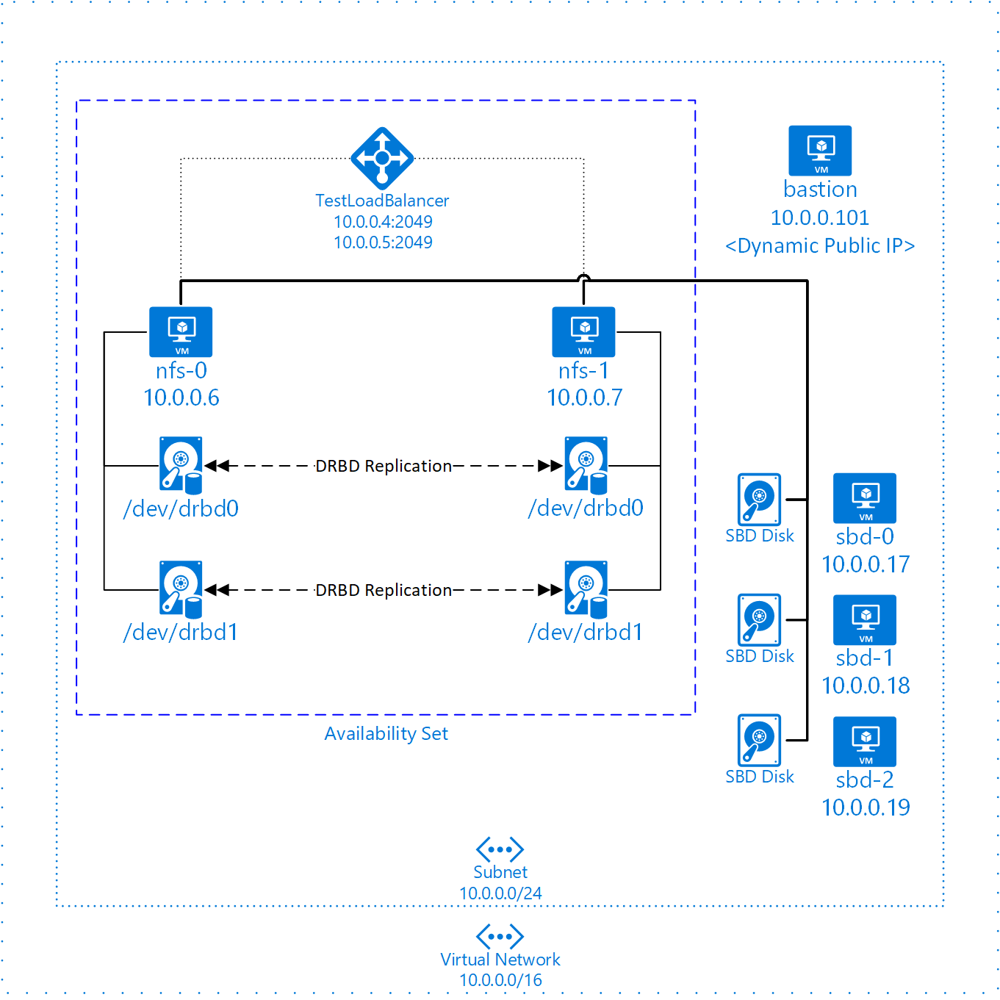

# Overview
# ***Use Terraform and Ansible to create a Pacemaker cluster offering highly available NFS.*** 
# Installation
## Requires the latest Terraform and Ansible
Azure Cloudshell has both Terraform and Ansible preinstalled, so cloning and launching from Cloudshell is convienent.
## Installation in your local Linux environment 
Cloudshell in the Portal times out after 20 minutes, so installing in your local environment or Linux VM is a good option.  If you use Cloudshell, you will have to hit the keyboard every now and then to prevent a timeout.
### Links to install requirements
- az CLI
    1. https://docs.microsoft.com/en-us/cli/azure/install-azure-cli-linux?pivots=apt
- Terraform
    1. https://learn.hashicorp.com/tutorials/terraform/install-cli
- Ansible    
    1. https://docs.ansible.com/ansible/latest/installation_guide/intro_installation.html#installing-ansible-on-specific-operating-systems

# Run the playbook
### Login az CLI:
```console
az login
```  
### Clone the repository and run this command from root of project folder:
```console
ansible-playbook -i hosts lab.yml
```  
The resources will be created in a resource group specified in the root of the repo's main.tf.

# Deleting the environment
### The cluster can be deprovisioned by running:
```console
terraform delete
```  
You can also simply delete the resource group the cluster is in.  If you manually delete the resource group, terraform will leave behind the files:
1. terraform.tfstate
1. terraform.tfstate.backup

Delete the tfstate files and you ready to spin up another cluster.  If you do not want to wait for the previous resource group to be deleted, you can create a new resource group name in network.tf, and the new resources will be spun up in the new resource group.

# Tips

### SSH Keys
If you do not already have SSH keys setup in your home directory, they will be created for you.  2 sets of keys will be created, a personal set and a lab set.  The personal public key will be added to the bastion node.  The username you should login with is 'azureadmin'.  If you already have personal SSH keys setup, you can login with your existing keys with the 'azureadmin' user.  Once you have logged into the bastion, you can SSH to the NFS nodes as the lab keys will have been installed on both the bastion and the NFS nodes.

***You can find the bastion's public IP by looking in the Portal or running 'terraform output' from the CLI:***
```console
$ terraform output  
bastion_ip = "40.65.106.174" #<----example IP
```  
***To login to the bastion:***
```console
ssh azureadmin@40.65.106.174  
```  
***To login to NFS node from bastion:***  
```console
azureadmin@bastion:~> ssh nfs-0
```  
***All nodes are contained in bastion node /etc/hosts:***
```console
azureadmin@bastion:~> tail -n 12 /etc/hosts
# BEGIN ANSIBLE MANAGED BLOCK
# IP address of the load balancer frontend configuration for NFS
10.0.0.4 nw1-nfs
10.0.0.5 nw2-nfs
# NFS cluster nodes
10.0.0.6 nfs-0
10.0.0.7 nfs-1
# SBD nodes
10.0.0.17 sbd-0
10.0.0.18 sbd-1
10.0.0.19 sbd-2
# END ANSIBLE MANAGED BLOCK
```  
### Mounting an NFS share  
```console
azureadmin@bastion:~> sudo mount -o nfsvers=4 10.0.0.4:/NW1 /mnt  
azureadmin@bastion:~> df -h  
Filesystem      Size  Used Avail Use% Mounted on  
devtmpfs         16G  8.0K   16G   1% /dev  
tmpfs            24G     0   24G   0% /dev/shm  
tmpfs            16G   18M   16G   1% /run  
tmpfs            16G     0   16G   0% /sys/fs/cgroup  
/dev/sda4        29G  2.7G   26G  10% /  
/dev/sda3      1014M   99M  916M  10% /boot  
/dev/sda2       512M  1.1M  511M   1% /boot/efi  
10.0.0.4:/NW1   100G   32M  100G   1% /mnt  
tmpfs           3.2G     0  3.2G   0% /run/user/1000  
tmpfs           3.2G     0  3.2G   0% /run/user/488  
azureadmin@bastion:~>
```
